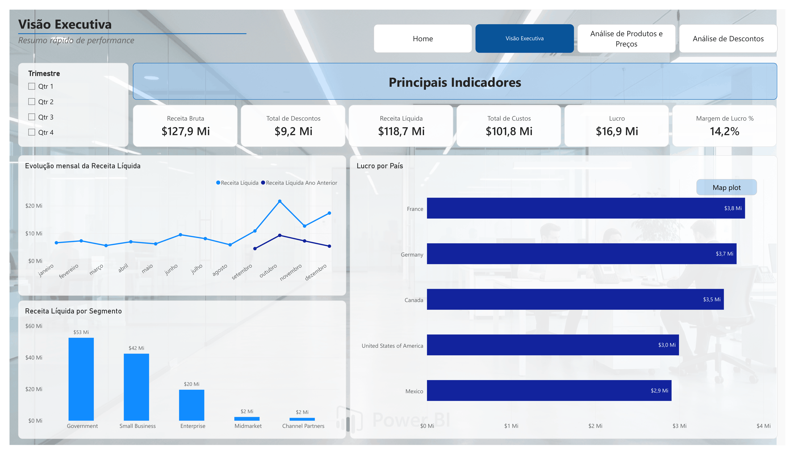
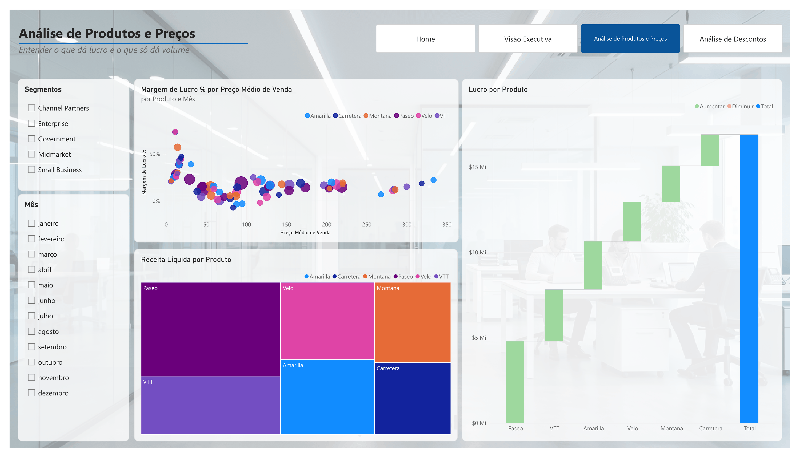
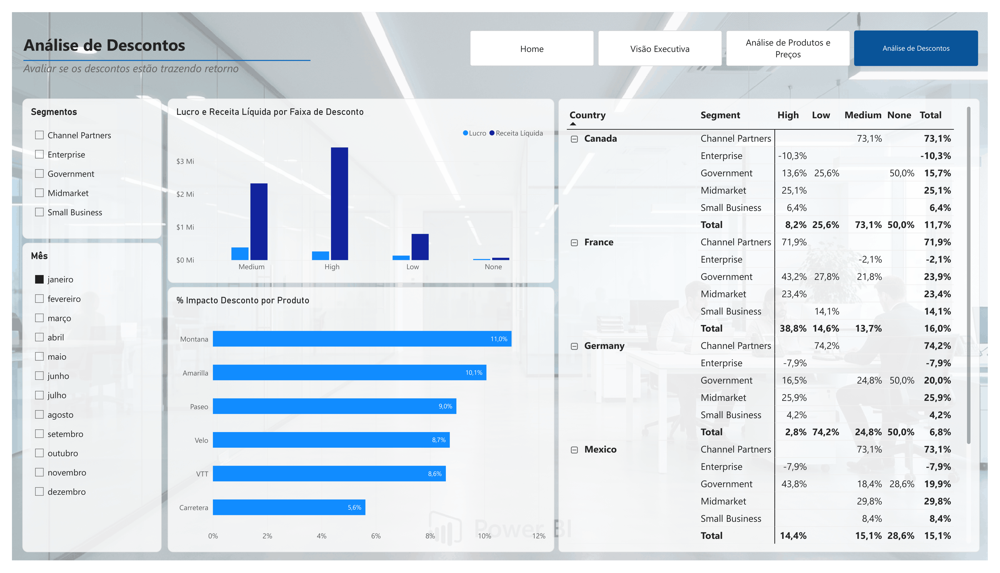

### Desafio de Projeto

# Relatório Vendas e Lucros com Data Analytics com Power BI

## Processo ETL: Extract, Transform, Load

### 1. _Extract_ (Extrair)

Nessa etapa, o objetivo é trazer os dados brutos da fonte original para o ambiente do Power BI. No caso, a pasta de trabalho do Excel de exemplo financeiro está disponível por meio do [link](https://go.microsoft.com/fwlink/?LinkID=521962) e foi hospedada no repositório deste [Desafio de Projeto](https://github.com/costandrad/dio-project-challenge-sales-and-profit-report-with-data-analytics/). Assim, no Power BI, a extração dos dados é feita clicando em "Obter Dados" → "Da web" e informando a URL _raw_ [https://raw.githubusercontent.com/costandrad/dio-project-challenge-managerial-dashboard-with-power-bi/main/01-database/financial_sample.xlsx](https://raw.githubusercontent.com/costandrad/dio-project-challenge-sales-and-profit-report-with-data-analytics/main/01-database/financial_sample.xlsx).


### 2. _Transform_ (Transformar)

A transformação começou com uma preparação inicial no Power Query, seguindo o [tutorial da Microsoft](https://learn.microsoft.com/pt-br/power-bi/create-reports/desktop-excel-stunning-report): Alteração do **Tipo de Dados** da coluna `Unit Solds` de **Número Decimal** para **Número Inteiro**.

Em seguida, os dados foram organizados em _**Star Schema**_ (Modelo de Esquema em Estrela). As tabelas dimensão criadas foram as seguintes:

- `d_Segment`:

```powerquery
let
    Fonte = Excel.Workbook(Web.Contents("https://raw.githubusercontent.com/costandrad/dio-project-challenge-managerial-dashboard-with-power-bi/main/01-database/financial_sample.xlsx"), null, true),
    financials_Table = Fonte{[Item="financials",Kind="Table"]}[Data],
    #"Tipo Alterado" = Table.TransformColumnTypes(financials_Table,{{"Segment", type text}, {"Country", type text}, {"Product", type text}, {"Discount Band", type text}, {"Units Sold", Int64.Type}, {"Manufacturing Price", Int64.Type}, {"Sale Price", Int64.Type}, {"Gross Sales", type number}, {"Discounts", type number}, {" Sales", type number}, {"COGS", type number}, {"Profit", type number}, {"Date", type date}, {"Month Number", Int64.Type}, {"Month Name", type text}, {"Year", Int64.Type}}),
    #"Outras Colunas Removidas" = Table.SelectColumns(#"Tipo Alterado",{"Segment"}),
    #"Duplicatas Removidas" = Table.Distinct(#"Outras Colunas Removidas"),
    #"Índice Adicionado" = Table.AddIndexColumn(#"Duplicatas Removidas", "Índice", 1, 1, Int64.Type),
    #"Colunas Renomeadas" = Table.RenameColumns(#"Índice Adicionado",{{"Índice", "id_Segment"}}),
    #"Colunas Reordenadas" = Table.ReorderColumns(#"Colunas Renomeadas",{"id_Segment", "Segment"})
in
    #"Colunas Reordenadas"
```

<figure style="text-align: center;">
    <figcaption>Tabela d_Segment</figcaption>
    
    <small>Fonte: <a href="https://github.com/costandrad">Autor</a></small>
</figure>


- `d_Country`

```powerquery
let
    Fonte = Excel.Workbook(Web.Contents("https://raw.githubusercontent.com/costandrad/dio-project-challenge-managerial-dashboard-with-power-bi/main/01-database/financial_sample.xlsx"), null, true),
    financials_Table = Fonte{[Item="financials",Kind="Table"]}[Data],
    #"Tipo Alterado" = Table.TransformColumnTypes(financials_Table,{{"Segment", type text}, {"Country", type text}, {"Product", type text}, {"Discount Band", type text}, {"Units Sold", Int64.Type}, {"Manufacturing Price", Int64.Type}, {"Sale Price", Int64.Type}, {"Gross Sales", type number}, {"Discounts", type number}, {" Sales", type number}, {"COGS", type number}, {"Profit", type number}, {"Date", type date}, {"Month Number", Int64.Type}, {"Month Name", type text}, {"Year", Int64.Type}}),
    #"Outras Colunas Removidas" = Table.SelectColumns(#"Tipo Alterado",{"Country"}),
    #"Duplicatas Removidas" = Table.Distinct(#"Outras Colunas Removidas"),
    #"Índice Adicionado" = Table.AddIndexColumn(#"Duplicatas Removidas", "Índice", 1, 1, Int64.Type),
    #"Colunas Renomeadas" = Table.RenameColumns(#"Índice Adicionado",{{"Índice", "ID_Country"}}),
    #"Colunas Reordenadas" = Table.ReorderColumns(#"Colunas Renomeadas",{"ID_Country", "Country"})
in
    #"Colunas Reordenadas"
```


<figure style="text-align: center;">
    <figcaption>Tabela d_Country</figcaption>
    
    <small>Fonte: <a href="https://github.com/costandrad">Autor</a></small>
</figure>


- `d_Product`

```powerquery
let
    Fonte = Excel.Workbook(Web.Contents("https://raw.githubusercontent.com/costandrad/dio-project-challenge-managerial-dashboard-with-power-bi/main/01-database/financial_sample.xlsx"), null, true),
    financials_Table = Fonte{[Item="financials",Kind="Table"]}[Data],
    #"Tipo Alterado" = Table.TransformColumnTypes(financials_Table,{{"Segment", type text}, {"Country", type text}, {"Product", type text}, {"Discount Band", type text}, {"Units Sold", Int64.Type}, {"Manufacturing Price", Int64.Type}, {"Sale Price", Int64.Type}, {"Gross Sales", type number}, {"Discounts", type number}, {" Sales", type number}, {"COGS", type number}, {"Profit", type number}, {"Date", type date}, {"Month Number", Int64.Type}, {"Month Name", type text}, {"Year", Int64.Type}}),
    #"Outras Colunas Removidas" = Table.SelectColumns(#"Tipo Alterado",{"Product", "Manufacturing Price"}),
    #"Duplicatas Removidas" = Table.Distinct(#"Outras Colunas Removidas", {"Product"}),
    #"Índice Adicionado" = Table.AddIndexColumn(#"Duplicatas Removidas", "Índice", 1, 1, Int64.Type),
    #"Colunas Renomeadas" = Table.RenameColumns(#"Índice Adicionado",{{"Índice", "ID_Product"}}),
    #"Colunas Reordenadas" = Table.ReorderColumns(#"Colunas Renomeadas",{"ID_Product", "Product", "Manufacturing Price"})
in
    #"Colunas Reordenadas"
```

<figure style="text-align: center;">
    <figcaption>Tabela d_Product</figcaption>
    
    <small>Fonte: <a href="https://github.com/costandrad">Autor</a></small>
</figure>


- `d_DiscountBand`

```powerquery
let
    Fonte = Excel.Workbook(Web.Contents("https://raw.githubusercontent.com/costandrad/dio-project-challenge-managerial-dashboard-with-power-bi/main/01-database/financial_sample.xlsx"), null, true),
    financials_Table = Fonte{[Item="financials",Kind="Table"]}[Data],
    #"Tipo Alterado" = Table.TransformColumnTypes(financials_Table,{{"Segment", type text}, {"Country", type text}, {"Product", type text}, {"Discount Band", type text}, {"Units Sold", Int64.Type}, {"Manufacturing Price", Int64.Type}, {"Sale Price", Int64.Type}, {"Gross Sales", type number}, {"Discounts", type number}, {" Sales", type number}, {"COGS", type number}, {"Profit", type number}, {"Date", type date}, {"Month Number", Int64.Type}, {"Month Name", type text}, {"Year", Int64.Type}}),
    #"Outras Colunas Removidas" = Table.SelectColumns(#"Tipo Alterado",{"Discount Band"}),
    #"Duplicatas Removidas" = Table.Distinct(#"Outras Colunas Removidas"),
    #"Índice Adicionado" = Table.AddIndexColumn(#"Duplicatas Removidas", "Índice", 1, 1, Int64.Type),
    #"Colunas Renomeadas" = Table.RenameColumns(#"Índice Adicionado",{{"Índice", "ID_DiscountBand"}}),
    #"Colunas Reordenadas" = Table.ReorderColumns(#"Colunas Renomeadas",{"ID_DiscountBand", "Discount Band"})
in
    #"Colunas Reordenadas"
```

<figure style="text-align: center;">
    <figcaption>Tabela dDiscountBand</figcaption>
    
    <small>Fonte: <a href="https://github.com/costandrad">Autor</a></small>
</figure>

- `d_Calendar`


A tabela fato `f_Vendas` foi criada conforme código abaixo:

```powerquery
let
    Fonte = Excel.Workbook(Web.Contents("https://raw.githubusercontent.com/costandrad/dio-project-challenge-managerial-dashboard-with-power-bi/main/01-database/financial_sample.xlsx"), null, true),
    financials_Table = Fonte{[Item="financials",Kind="Table"]}[Data],
    #"Tipo Alterado" = Table.TransformColumnTypes(financials_Table,{{"Segment", type text}, {"Country", type text}, {"Product", type text}, {"Discount Band", type text}, {"Units Sold", Int64.Type}, {"Manufacturing Price", Int64.Type}, {"Sale Price", Int64.Type}, {"Gross Sales", type number}, {"Discounts", type number}, {" Sales", type number}, {"COGS", type number}, {"Profit", type number}, {"Date", type date}, {"Month Number", Int64.Type}, {"Month Name", type text}, {"Year", Int64.Type}}),
    #"Consultas Mescladas" = Table.NestedJoin(#"Tipo Alterado", {"Segment"}, d_Segment, {"Segment"}, "d_Segment", JoinKind.LeftOuter),
    #"d_Segment Expandido" = Table.ExpandTableColumn(#"Consultas Mescladas", "d_Segment", {"ID_Segment"}, {"d_Segment.ID_Segment"}),
    #"Colunas Renomeadas" = Table.RenameColumns(#"d_Segment Expandido",{{"d_Segment.ID_Segment", "ID_Segment"}}),
    #"Colunas Reordenadas" = Table.ReorderColumns(#"Colunas Renomeadas",{"ID_Segment", "Segment", "Country", "Product", "Discount Band", "Units Sold", "Manufacturing Price", "Sale Price", "Gross Sales", "Discounts", " Sales", "COGS", "Profit", "Date", "Month Number", "Month Name", "Year"}),
    #"Colunas Removidas" = Table.RemoveColumns(#"Colunas Reordenadas",{"Segment"}),
    #"Consultas Mescladas1" = Table.NestedJoin(#"Colunas Removidas", {"Country"}, d_Country, {"Country"}, "d_Country", JoinKind.LeftOuter),
    #"d_Country Expandido" = Table.ExpandTableColumn(#"Consultas Mescladas1", "d_Country", {"ID_Country"}, {"d_Country.ID_Country"}),
    #"Colunas Renomeadas1" = Table.RenameColumns(#"d_Country Expandido",{{"d_Country.ID_Country", "ID_Country"}}),
    #"Colunas Reordenadas1" = Table.ReorderColumns(#"Colunas Renomeadas1",{"ID_Segment", "ID_Country", "Country", "Product", "Discount Band", "Units Sold", "Manufacturing Price", "Sale Price", "Gross Sales", "Discounts", " Sales", "COGS", "Profit", "Date", "Month Number", "Month Name", "Year"}),
    #"Colunas Removidas1" = Table.RemoveColumns(#"Colunas Reordenadas1",{"Country"}),
    #"Consultas Mescladas2" = Table.NestedJoin(#"Colunas Removidas1", {"Product"}, d_Product, {"Product"}, "d_Product", JoinKind.LeftOuter),
    #"d_Product Expandido" = Table.ExpandTableColumn(#"Consultas Mescladas2", "d_Product", {"ID_Product"}, {"d_Product.ID_Product"}),
    #"Colunas Renomeadas2" = Table.RenameColumns(#"d_Product Expandido",{{"d_Product.ID_Product", "ID_Product"}}),
    #"Colunas Reordenadas2" = Table.ReorderColumns(#"Colunas Renomeadas2",{"ID_Segment", "ID_Country", "ID_Product", "Product", "Discount Band", "Units Sold", "Manufacturing Price", "Sale Price", "Gross Sales", "Discounts", " Sales", "COGS", "Profit", "Date", "Month Number", "Month Name", "Year"}),
    #"Colunas Removidas2" = Table.RemoveColumns(#"Colunas Reordenadas2",{"Product", "Manufacturing Price"}),
    #"Consultas Mescladas3" = Table.NestedJoin(#"Colunas Removidas2", {"Discount Band"}, d_DiscountBand, {"Discount Band"}, "d_DiscountBand", JoinKind.LeftOuter),
    #"d_DiscountBand Expandido" = Table.ExpandTableColumn(#"Consultas Mescladas3", "d_DiscountBand", {"ID_DiscountBand"}, {"d_DiscountBand.ID_DiscountBand"}),
    #"Colunas Renomeadas3" = Table.RenameColumns(#"d_DiscountBand Expandido",{{"d_DiscountBand.ID_DiscountBand", "ID_DiscountBand"}}),
    #"Colunas Reordenadas3" = Table.ReorderColumns(#"Colunas Renomeadas3",{"ID_Segment", "ID_Country", "ID_Product", "ID_DiscountBand", "Discount Band", "Units Sold", "Sale Price", "Gross Sales", "Discounts", " Sales", "COGS", "Profit", "Date", "Month Number", "Month Name", "Year"}),
    #"Colunas Removidas3" = Table.RemoveColumns(#"Colunas Reordenadas3",{"Discount Band", "Month Number", "Month Name", "Year"})
in
    #"Colunas Removidas3"
```

<figure style="text-align: center;">
    <figcaption>Primeiras linhas da tabela fato f_Vendas</figcaption>
    
    <small>Fonte: <a href="https://github.com/costandrad">Autor</a></small>
</figure>

Como resultado, o modelo em estrela resultante é mostrado na figura abaixo:


<figure style="text-align: center;">
    <figcaption>Modelo Star Schema</figcaption>
    
    <small>Fonte: <a href="https://github.com/costandrad">Autor</a></small>
</figure>


### 3. _Load_ (Carregar)


Na etapa final, os dados transformados são gravados no destino escolhido a fim de alimentar diretamente um modelo no Power BI. Como o arquivo é pequeno e estático, uma carga completa costuma ser suficiente. Ao final dessa etapa, os dados estão disponíveis em um ambiente confiável e otimizado para consulta — fechando o ciclo do ETL iniciado com a extração do link raw no GitHub.


## Resumo do Relatório

### 1. Visão Geral e Estrutura de Navegação

O relatório é composto por **4 páginas (Capa + 3 Páginas de Análise)**.

#### Sistema de Navegação entre Páginas
Cada página interna possui um **menu superior / lateral de botões de navegação** padronizado, permitindo alternar rapidamente entre as seções:
* **Home** (retorna à Capa)
* **Visão Executiva**
* **Análise de Produtos e Preços**
* **Análise de Descontos**
  

### 2. Estrutura e Detalhamento por Página


#### Página 0: Capa
* **Layout:** Imagem de fundo corporativa em tons de azul e verde com design profissional e logotipo do Power BI no canto inferior direito.
* **Título Principal:** "Desafio de Projeto - Relatório Gerencial: Visão Executiva e Data Analytics".
* **Visuais:** Apenas elemento visual estético de abertura/apresentação (sem dados numéricos).


<figure style="text-align: center;">
    <figcaption>Capa do Relatório</figcaption>
    
    <small>Fonte: <a href="https://github.com/costandrad">Autor</a></small>
</figure>

#### Página 1: Visão Executiva
* **Objetivo / Subtítulo:** Resumo rápido de performance e principais KPIs globais.

<figure style="text-align: center;">
    <figcaption>Página 1 - Visão Executiva</figcaption>
    
    <small>Fonte: <a href="https://github.com/costandrad">Autor</a></small>
</figure>

##### Layout
* **Menu de Navegação:** Canto superior direito / inferior direito.
* **Cartões de KPIs (Topo / Lateral):** Destaque para métricas gerais.
* **Filtros (Slicers):** Filtro por Trimestres (`Qtr 1`, `Qtr 2`, `Qtr 3`, `Qtr 4`).

##### Visuais e Indicadores
1. **Cartões de Indicadores Chave (KPIs):**
   * **Receita Bruta:** $127,9 Mi
   * **Total de Descontos:** $9,2 Mi
   * **Receita Líquida:** $118,7 Mi
   * **Total de Custos:** $101,8 Mi
   * **Lucro:** $16,9 Mi
   * **Margem de Lucro %:** 14,2%
2. **Lucro por País:** Gráfico de barras horizontais detalhando a rentabilidade por país (França, Alemanha, Canadá, EUA e México).
3. **Visão Geográfica:** Gráfico de Mapa (*Map plot*) para distribuição das métricas no mapa mundial.
4. **Evolução Mensal da Receita Líquida:** Gráfico de linhas comparando a *Receita Líquida* atual com a *Receita Líquida do Ano Anterior* de janeiro a dezembro.
5. **Receita Líquida por Segmento:** Gráfico de colunas/barras comparando os segmentos (Government, Small Business, Enterprise, Midmarket, Channel Partners).


#### Página 2: Análise de Produtos e Preços
* **Objetivo / Subtítulo:** Entender o que dá lucro e o que só dá volume.

<figure style="text-align: center;">
    <figcaption>Página 2 - Análise de Produtos e Preços</figcaption>
    
    <small>Fonte: <a href="https://github.com/costandrad">Autor</a></small>
</figure>

##### Layout
* **Filtros Laterais (Slicers):** Filtros à esquerda para seleção de **Segmentos** e **Mês**.
* **Menu de Navegação:** Botões na barra superior à direita.
* **Distribuição de Tela:** Área central dividida entre gráficos de dispersão, mapa de árvore (Treemap) e gráfico de cascata (Waterfall).

##### Visuais
1. **Margem de Lucro % por Preço Médio de Venda por Produto e Mês:** Gráfico de dispersão (*Scatter Plot*) correlacionando o preço médio de venda com a margem de lucro por produto/mês.
2. **Receita Líquida por Produto:** Gráfico de Treemap (*Mapa de Árvore*) mostrando a proporção da receita de cada produto (Paseo, VTT, Velo, Amarilla, Montana, Carretera).
3. **Lucro por Produto:** Gráfico de Cascata (*Waterfall Chart*) destacando as contribuições individuais de cada produto no lucro total.


#### Página 3: Análise de Descontos
* **Objetivo / Subtítulo:** Avaliar se os descontos estão trazendo retorno.

<figure style="text-align: center;">
    <figcaption>Página 3 - Análise de Descontos</figcaption>
    
    <small>Fonte: <a href="https://github.com/costandrad">Autor</a></small>
</figure>

##### Layout
* **Filtros Laterais/Inferiores (Slicers):** Filtros rápidos para **Country** (País), **Mês** e **Segmentos**.
* **Menu de Navegação:** Botões de navegação no canto inferior/superior.
* **Organização dos Visuais:** Gráficos de barras na parte superior e matriz de dados detalhada no painel central/inferior.

##### Visuais
1. **% Impacto Desconto por Produto:** Gráfico de barras horizontais indicando a porcentagem de desconto por produto (Montana, Amarilla, Paseo, Velo, VTT, Carretera).
2. **Lucro e Receita Líquida por Faixa de Desconto:** Gráfico de colunas agrupadas avaliando diferentes faixas (*Medium*, *High*, *Low*, *None*).
3. **Tabela / Matriz Detalhada:** Matriz por País e Segmento detalhando o impacto/retorno percentual em cada faixa de desconto (*High*, *Low*, *Medium*, *None*, *Total*).