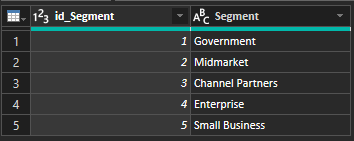
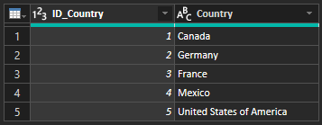
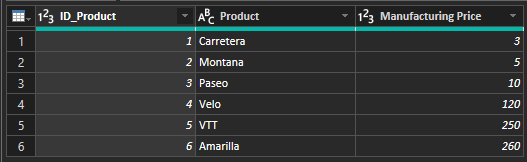
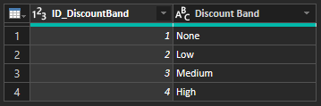
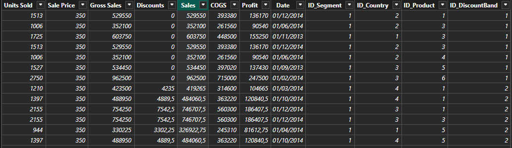
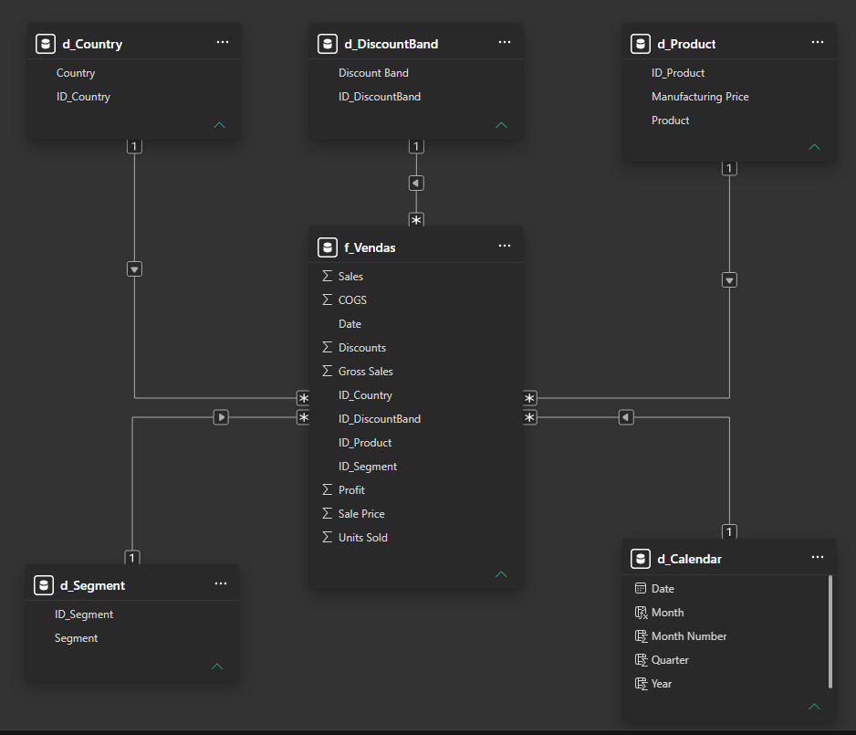

### Desafio de Projeto

# Relatório Vendas e Lucros com Data Analytics com Power BI

## Processo ETL: Extrac, Transform, Load

### 1. _Extract_ (Extrair)

Nessa etapa, o objetivo é trazer os dados brutos da fonte original para o ambiente do Power BI. No caso, a pasta de trabalho do Excel de exemplo financeiro está disponível por meio do [link](https://go.microsoft.com/fwlink/?LinkID=521962) e foi hospedada no repositório deste [Desafio de Projeto](https://github.com/costandrad/dio-project-challenge-managerial-dashboard-with-power-bi/). Assim, no Power BI, a extração dos dados é feita clicando em "Obter Dados" → "Da web" e informando a URL _raw_ [https://raw.githubusercontent.com/costandrad/dio-project-challenge-managerial-dashboard-with-power-bi/main/01-database/financial_sample.xlsx](https://raw.githubusercontent.com/costandrad/dio-project-challenge-managerial-dashboard-with-power-bi/main/01-database/financial_sample.xlsx).


### 2. _Transform_ (Transformar)

A transformação começou com uma preparação inicial no Power Query, seguindo o [tutorial da Microsoft](https://learn.microsoft.com/pt-br/power-bi/create-reports/desktop-excel-stunning-report): Alteração do **Tipo de Dados** da coluna `Unit Solds` de **Número Decimal** para **Número Inteiro**.

Em seguida, os dados foram organizados em _**Star Schema**_ (Modelo de Esquema em Estrela). As tabelas dimensão criadas foram as seguintes:

- `d_Segment`:

```powerquery
let
    Fonte = Excel.Workbook(Web.Contents("https://raw.githubusercontent.com/costandrad/dio-project-challenge-managerial-dashboard-with-power-bi/main/01-database/financial_sample.xlsx"), null, true),
    financials_Table = Fonte{[Item="financials",Kind="Table"]}[Data],
    #"Tipo Alterado" = Table.TransformColumnTypes(financials_Table,{{"Segment", type text}, {"Country", type text}, {"Product", type text}, {"Discount Band", type text}, {"Units Sold", Int64.Type}, {"Manufacturing Price", Int64.Type}, {"Sale Price", Int64.Type}, {"Gross Sales", type number}, {"Discounts", type number}, {" Sales", type number}, {"COGS", type number}, {"Profit", type number}, {"Date", type date}, {"Month Number", Int64.Type}, {"Month Name", type text}, {"Year", Int64.Type}}),
    #"Outras Colunas Removidas" = Table.SelectColumns(#"Tipo Alterado",{"Segment"}),
    #"Duplicatas Removidas" = Table.Distinct(#"Outras Colunas Removidas"),
    #"Índice Adicionado" = Table.AddIndexColumn(#"Duplicatas Removidas", "Índice", 1, 1, Int64.Type),
    #"Colunas Renomeadas" = Table.RenameColumns(#"Índice Adicionado",{{"Índice", "id_Segment"}}),
    #"Colunas Reordenadas" = Table.ReorderColumns(#"Colunas Renomeadas",{"id_Segment", "Segment"})
in
    #"Colunas Reordenadas"
```

<figure style="text-align: center;">
    <figcaption>Tabela d_Segment</figcaption>
    
    <small>Fonte: <a href="https://github.com/costandrad">Autor</a></small>
</figure>


- `d_Country`

```powerquery
let
    Fonte = Excel.Workbook(Web.Contents("https://raw.githubusercontent.com/costandrad/dio-project-challenge-managerial-dashboard-with-power-bi/main/01-database/financial_sample.xlsx"), null, true),
    financials_Table = Fonte{[Item="financials",Kind="Table"]}[Data],
    #"Tipo Alterado" = Table.TransformColumnTypes(financials_Table,{{"Segment", type text}, {"Country", type text}, {"Product", type text}, {"Discount Band", type text}, {"Units Sold", Int64.Type}, {"Manufacturing Price", Int64.Type}, {"Sale Price", Int64.Type}, {"Gross Sales", type number}, {"Discounts", type number}, {" Sales", type number}, {"COGS", type number}, {"Profit", type number}, {"Date", type date}, {"Month Number", Int64.Type}, {"Month Name", type text}, {"Year", Int64.Type}}),
    #"Outras Colunas Removidas" = Table.SelectColumns(#"Tipo Alterado",{"Country"}),
    #"Duplicatas Removidas" = Table.Distinct(#"Outras Colunas Removidas"),
    #"Índice Adicionado" = Table.AddIndexColumn(#"Duplicatas Removidas", "Índice", 1, 1, Int64.Type),
    #"Colunas Renomeadas" = Table.RenameColumns(#"Índice Adicionado",{{"Índice", "ID_Country"}}),
    #"Colunas Reordenadas" = Table.ReorderColumns(#"Colunas Renomeadas",{"ID_Country", "Country"})
in
    #"Colunas Reordenadas"
```


<figure style="text-align: center;">
    <figcaption>Tabela d_Country</figcaption>
    
    <small>Fonte: <a href="https://github.com/costandrad">Autor</a></small>
</figure>


- `d_Product`

```powerquery
let
    Fonte = Excel.Workbook(Web.Contents("https://raw.githubusercontent.com/costandrad/dio-project-challenge-managerial-dashboard-with-power-bi/main/01-database/financial_sample.xlsx"), null, true),
    financials_Table = Fonte{[Item="financials",Kind="Table"]}[Data],
    #"Tipo Alterado" = Table.TransformColumnTypes(financials_Table,{{"Segment", type text}, {"Country", type text}, {"Product", type text}, {"Discount Band", type text}, {"Units Sold", Int64.Type}, {"Manufacturing Price", Int64.Type}, {"Sale Price", Int64.Type}, {"Gross Sales", type number}, {"Discounts", type number}, {" Sales", type number}, {"COGS", type number}, {"Profit", type number}, {"Date", type date}, {"Month Number", Int64.Type}, {"Month Name", type text}, {"Year", Int64.Type}}),
    #"Outras Colunas Removidas" = Table.SelectColumns(#"Tipo Alterado",{"Product", "Manufacturing Price"}),
    #"Duplicatas Removidas" = Table.Distinct(#"Outras Colunas Removidas", {"Product"}),
    #"Índice Adicionado" = Table.AddIndexColumn(#"Duplicatas Removidas", "Índice", 1, 1, Int64.Type),
    #"Colunas Renomeadas" = Table.RenameColumns(#"Índice Adicionado",{{"Índice", "ID_Product"}}),
    #"Colunas Reordenadas" = Table.ReorderColumns(#"Colunas Renomeadas",{"ID_Product", "Product", "Manufacturing Price"})
in
    #"Colunas Reordenadas"
```

<figure style="text-align: center;">
    <figcaption>Tabela d_Product</figcaption>
    
    <small>Fonte: <a href="https://github.com/costandrad">Autor</a></small>
</figure>


- `d_DiscountBand`

```powerquery
let
    Fonte = Excel.Workbook(Web.Contents("https://raw.githubusercontent.com/costandrad/dio-project-challenge-managerial-dashboard-with-power-bi/main/01-database/financial_sample.xlsx"), null, true),
    financials_Table = Fonte{[Item="financials",Kind="Table"]}[Data],
    #"Tipo Alterado" = Table.TransformColumnTypes(financials_Table,{{"Segment", type text}, {"Country", type text}, {"Product", type text}, {"Discount Band", type text}, {"Units Sold", Int64.Type}, {"Manufacturing Price", Int64.Type}, {"Sale Price", Int64.Type}, {"Gross Sales", type number}, {"Discounts", type number}, {" Sales", type number}, {"COGS", type number}, {"Profit", type number}, {"Date", type date}, {"Month Number", Int64.Type}, {"Month Name", type text}, {"Year", Int64.Type}}),
    #"Outras Colunas Removidas" = Table.SelectColumns(#"Tipo Alterado",{"Discount Band"}),
    #"Duplicatas Removidas" = Table.Distinct(#"Outras Colunas Removidas"),
    #"Índice Adicionado" = Table.AddIndexColumn(#"Duplicatas Removidas", "Índice", 1, 1, Int64.Type),
    #"Colunas Renomeadas" = Table.RenameColumns(#"Índice Adicionado",{{"Índice", "ID_DiscountBand"}}),
    #"Colunas Reordenadas" = Table.ReorderColumns(#"Colunas Renomeadas",{"ID_DiscountBand", "Discount Band"})
in
    #"Colunas Reordenadas"
```

<figure style="text-align: center;">
    <figcaption>Tabela dDiscountBand</figcaption>
    
    <small>Fonte: <a href="https://github.com/costandrad">Autor</a></small>
</figure>

- `d_Calendar`


A tabela fato `f_Vendas` foi criada conforme código abaixo:

```powerquery
let
    Fonte = Excel.Workbook(Web.Contents("https://raw.githubusercontent.com/costandrad/dio-project-challenge-managerial-dashboard-with-power-bi/main/01-database/financial_sample.xlsx"), null, true),
    financials_Table = Fonte{[Item="financials",Kind="Table"]}[Data],
    #"Tipo Alterado" = Table.TransformColumnTypes(financials_Table,{{"Segment", type text}, {"Country", type text}, {"Product", type text}, {"Discount Band", type text}, {"Units Sold", Int64.Type}, {"Manufacturing Price", Int64.Type}, {"Sale Price", Int64.Type}, {"Gross Sales", type number}, {"Discounts", type number}, {" Sales", type number}, {"COGS", type number}, {"Profit", type number}, {"Date", type date}, {"Month Number", Int64.Type}, {"Month Name", type text}, {"Year", Int64.Type}}),
    #"Consultas Mescladas" = Table.NestedJoin(#"Tipo Alterado", {"Segment"}, d_Segment, {"Segment"}, "d_Segment", JoinKind.LeftOuter),
    #"d_Segment Expandido" = Table.ExpandTableColumn(#"Consultas Mescladas", "d_Segment", {"ID_Segment"}, {"d_Segment.ID_Segment"}),
    #"Colunas Renomeadas" = Table.RenameColumns(#"d_Segment Expandido",{{"d_Segment.ID_Segment", "ID_Segment"}}),
    #"Colunas Reordenadas" = Table.ReorderColumns(#"Colunas Renomeadas",{"ID_Segment", "Segment", "Country", "Product", "Discount Band", "Units Sold", "Manufacturing Price", "Sale Price", "Gross Sales", "Discounts", " Sales", "COGS", "Profit", "Date", "Month Number", "Month Name", "Year"}),
    #"Colunas Removidas" = Table.RemoveColumns(#"Colunas Reordenadas",{"Segment"}),
    #"Consultas Mescladas1" = Table.NestedJoin(#"Colunas Removidas", {"Country"}, d_Country, {"Country"}, "d_Country", JoinKind.LeftOuter),
    #"d_Country Expandido" = Table.ExpandTableColumn(#"Consultas Mescladas1", "d_Country", {"ID_Country"}, {"d_Country.ID_Country"}),
    #"Colunas Renomeadas1" = Table.RenameColumns(#"d_Country Expandido",{{"d_Country.ID_Country", "ID_Country"}}),
    #"Colunas Reordenadas1" = Table.ReorderColumns(#"Colunas Renomeadas1",{"ID_Segment", "ID_Country", "Country", "Product", "Discount Band", "Units Sold", "Manufacturing Price", "Sale Price", "Gross Sales", "Discounts", " Sales", "COGS", "Profit", "Date", "Month Number", "Month Name", "Year"}),
    #"Colunas Removidas1" = Table.RemoveColumns(#"Colunas Reordenadas1",{"Country"}),
    #"Consultas Mescladas2" = Table.NestedJoin(#"Colunas Removidas1", {"Product"}, d_Product, {"Product"}, "d_Product", JoinKind.LeftOuter),
    #"d_Product Expandido" = Table.ExpandTableColumn(#"Consultas Mescladas2", "d_Product", {"ID_Product"}, {"d_Product.ID_Product"}),
    #"Colunas Renomeadas2" = Table.RenameColumns(#"d_Product Expandido",{{"d_Product.ID_Product", "ID_Product"}}),
    #"Colunas Reordenadas2" = Table.ReorderColumns(#"Colunas Renomeadas2",{"ID_Segment", "ID_Country", "ID_Product", "Product", "Discount Band", "Units Sold", "Manufacturing Price", "Sale Price", "Gross Sales", "Discounts", " Sales", "COGS", "Profit", "Date", "Month Number", "Month Name", "Year"}),
    #"Colunas Removidas2" = Table.RemoveColumns(#"Colunas Reordenadas2",{"Product", "Manufacturing Price"}),
    #"Consultas Mescladas3" = Table.NestedJoin(#"Colunas Removidas2", {"Discount Band"}, d_DiscountBand, {"Discount Band"}, "d_DiscountBand", JoinKind.LeftOuter),
    #"d_DiscountBand Expandido" = Table.ExpandTableColumn(#"Consultas Mescladas3", "d_DiscountBand", {"ID_DiscountBand"}, {"d_DiscountBand.ID_DiscountBand"}),
    #"Colunas Renomeadas3" = Table.RenameColumns(#"d_DiscountBand Expandido",{{"d_DiscountBand.ID_DiscountBand", "ID_DiscountBand"}}),
    #"Colunas Reordenadas3" = Table.ReorderColumns(#"Colunas Renomeadas3",{"ID_Segment", "ID_Country", "ID_Product", "ID_DiscountBand", "Discount Band", "Units Sold", "Sale Price", "Gross Sales", "Discounts", " Sales", "COGS", "Profit", "Date", "Month Number", "Month Name", "Year"}),
    #"Colunas Removidas3" = Table.RemoveColumns(#"Colunas Reordenadas3",{"Discount Band", "Month Number", "Month Name", "Year"})
in
    #"Colunas Removidas3"
```

<figure style="text-align: center;">
    <figcaption>Primeiras linhas da tabela fato f_Vendas</figcaption>
    
    <small>Fonte: <a href="https://github.com/costandrad">Autor</a></small>
</figure>

Como resultado, o modelo em estrela resultante é mostrado na figura abaixo:


<figure style="text-align: center;">
    <figcaption>Modelo Star Schema</figcaption>
    
    <small>Fonte: <a href="https://github.com/costandrad">Autor</a></small>
</figure>


### 3. _Load_ (Carregar)


Na etapa final, os dados transformados são gravados no destino escolhido a fim de alimentar diretamente um modelo no Power BI. Como o arquivo é pequeno e estático, uma carga completa costuma ser suficiente. Ao final dessa etapa, os dados estão disponíveis em um ambiente confiável e otimizado para consulta — fechando o ciclo do ETL iniciado com a extração do link raw no GitHub.


## Resumo do Relatório

O relatório é dividido em três páginas temáticas, com foco em análise financeira e comercial:

Página 1 — Visão Executiva
Objetivo: Resumo rápido de performance.

KPIs principais: Receita Bruta ($127,9 Mi), Total de Descontos ($9,2 Mi), Receita Líquida ($118,7 Mi), Total de Custos ($101,8 Mi), Lucro ($16,9 Mi) e Margem de Lucro (14,2%).
Visual 1 — Evolução mensal da Receita Líquida: gráfico de linhas comparando o ano atual com o ano anterior (sazonalidade com pico em outubro).
Visual 2 — Lucro por País e Segmento: gráfico de barras empilhadas horizontais, mostrando que o segmento Government é o que mais contribui para o lucro em todos os países.
Visual 3 — Receita Líquida por País e Segmento: gráfico de colunas agrupadas, com destaque para o alto volume de Government e Small Business.
Página 2 — Análise de Produtos e Preços
Objetivo: Entender o que dá lucro e o que só dá volume.

Visual 1 — Margem de Lucro % por Preço Médio de Venda: gráfico de dispersão que mostra a relação entre preço e margem, com destaque para produtos de baixo preço e alta margem (ex: Montana) versus alto preço e baixa margem (ex: VTT).
Visual 2 — Lucro por Produto: gráfico de cascata (waterfall) mostrando a contribuição de cada produto para o lucro total. Carretera é o produto mais lucrativo, enquanto Paseo é o que menos contribui.
Visual 3 — Receita Líquida por Produto: treemap com a participação de cada produto na receita. Paseo lidera em volume de receita, seguido por Velo e Amarilla.
Página 3 — Análise de Descontos
Objetivo: Avaliar se os descontos estão trazendo retorno.

Visual 1 — Lucro e Receita Líquida por Faixa de Desconto: gráfico de colunas agrupadas mostrando que a faixa Medium gera maior receita líquida, mas a faixa Low apresenta melhor relação lucro/receita.
Visual 2 — % Impacto Desconto por Produto: gráfico de barras horizontais com o percentual de impacto dos descontos sobre a receita bruta. Velo (8,0%) e Carretera (7,5%) são os mais afetados.
Tabela auxiliar: matriz com a Margem de Lucro % por País, Segmento e Faixa de Desconto, evidenciando que:
Channel Partners e Midmarket mantêm margens altas mesmo com descontos.
Enterprise tem margens negativas em quase todas as faixas (exceto "None").
Government e Small Business têm margens positivas, mas menores que os demais segmentos.
Principais Insights
Government é o segmento mais lucrativo e com maior receita em todos os países.
Enterprise opera com margens negativas na maioria dos cenários com desconto.
Carretera é o produto mais lucrativo, enquanto Paseo tem o maior volume de receita, mas baixa contribuição para o lucro.
Descontos da faixa Low e Medium são os que melhor equilibram volume e lucratividade.
Velo e Carretera são os produtos mais impactados por descontos.